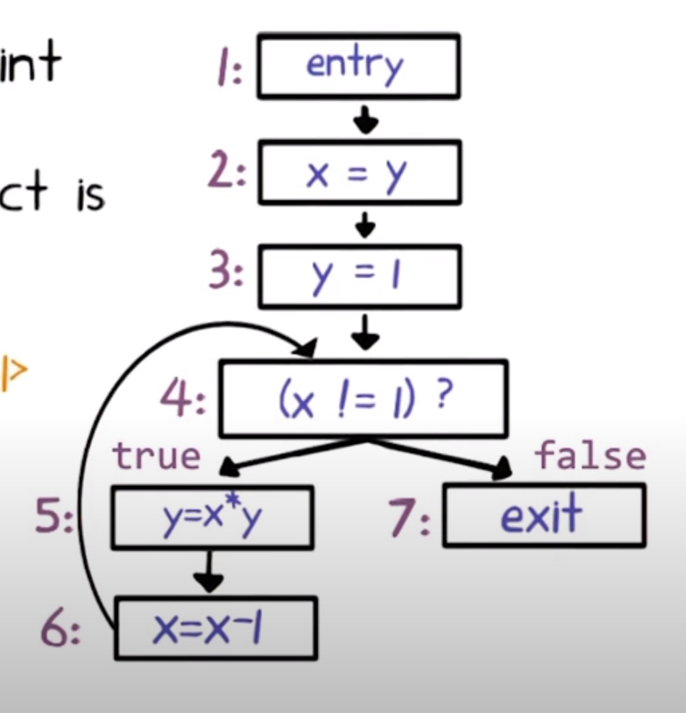
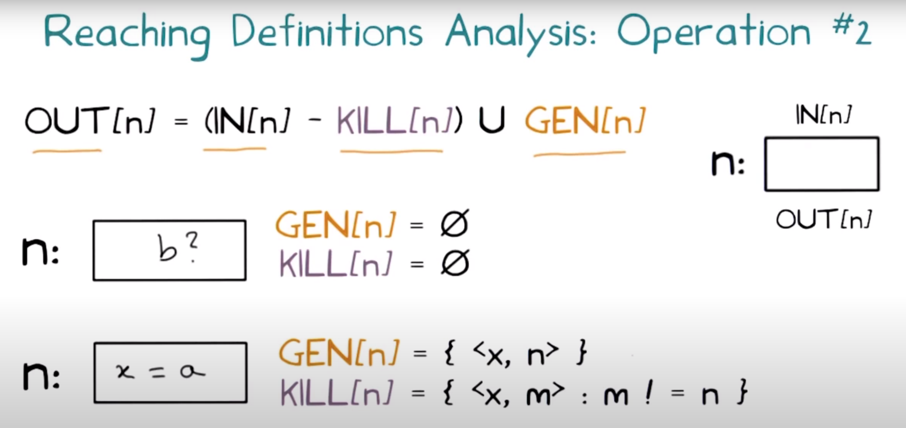
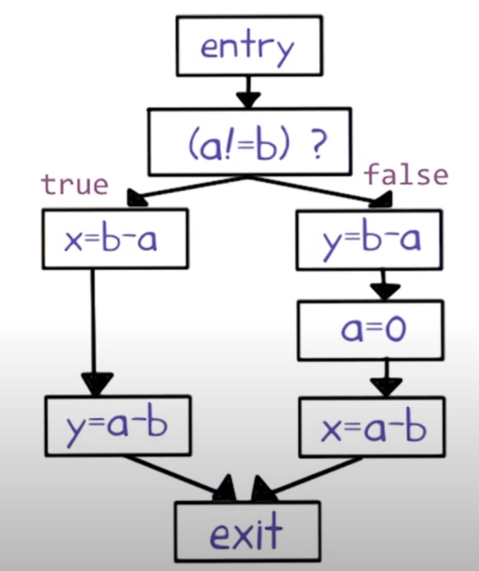
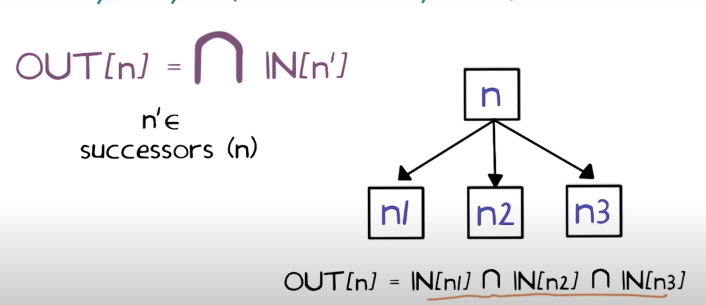
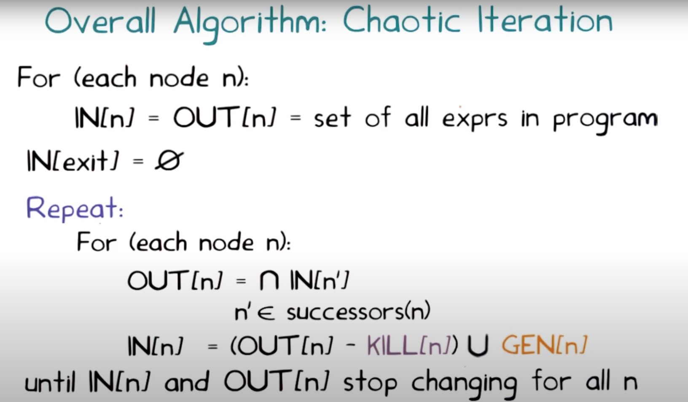
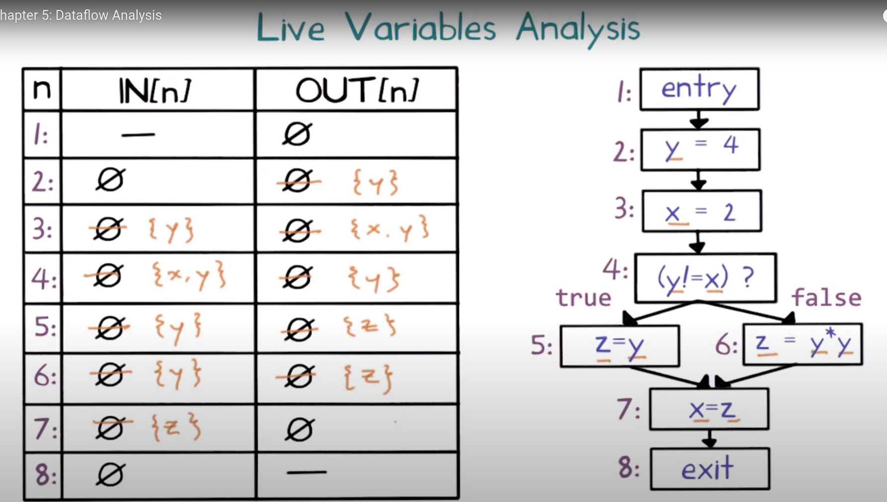
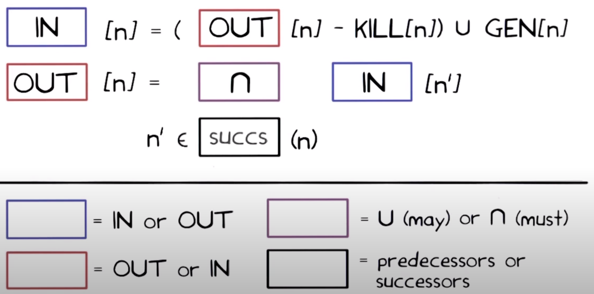

# Lección 2 - Análisis de Dataflow

Es un tipo de análisis estático que razona sobre el flujo de los datos en un
programa. Esto pueden ser constantes, variables o expresiones.

## WHILE language

Ejemplo
```text
x = 5;
y = 1;

while (x != 1) {
  y = x * y;
  x = x - 1.
}
```

Gramática para el lenguaje WHILE

```text
(statement)
S ::= x = a
  | S1 ; S2
  | if (b) { S1 } else { S2 }
  | while (b) { S1 }

(arithmetic expression)
a ::= x
  | n
  | a1 * a2
  | a1 - a2
  // se puede agregar suma y division pero por ahora se deja afuera

(boolean expresion)
b ::= true
  | !b
  | b1 && b2
  | a1 != a2

(integer variable) x
(integer constant) n
```

## CFGs

El dataflow analysis por lo general opera sobre una representación intermedia
útil de los programas. Una de las cuales son los *Control flow graphs*. Son un
grafo que sumarizan el flujo de control en todas las posibles corridas del
programa.

## Soundness, completeness y termination

Es imposible crear un análisis que logre los tres. El análisis de dataflow
sacrifica **completeness** pero garantiza soundness y termination.

- Sound: va a reportar todos los facts que podrían ocurrir en runs reales

## Abstracting control flow conditions

El dataflow analysis abstrae las condiciones del flujo de ocntrol con
non-deterministic choice (denotado por *). El análisis asume que las condiciones
pueden evaluar a true o false (a pesar de que tal vez en corridas reales siempre
evalúa a uno solo).


De esta forma, garantiza que analiza todos los flujos de control posibles del
programa (sound) y tal vez flujos que no son nunca posibles (incomplete)

## Aplicaciones de dataflow analysis

4 formas clásicas,

- Reaching definitions analysis
  - Encontrar usos de varialbes no inicializadas
- Very busy expressions analysis
  - Reducir tamaño de codigo
- Available expressions analysis
  - Evitar recompoutar expresiones (codigo mas eficiente)
- Live variables analysis
  - Asignar registros a variables efectivamente (esto es la responsabilidad del
    compilador que más afecta la performance del código generado)

### Reaching definitions analysis

> Cada dataflow analysis tiene un **goal** que especifica la información de
> dataflow que computa el análisis

El **goal** de reaching definitions es determinar que asignaciones pueden llegar
a cierto punto del programa. Para cada punto, que asignaciones se hicieron y no
se sobreescribieron cuando la ejecución llega a ese punto a través de algún
camino.

assignment = definition en WHILE

#### Resultado (informal)

El resultado es un conjunto de *facts* en cada punto del programa. Cada fact en
reaching definitions es un par `<defined variable name, defined node label>`



Por ejemplo,

- `<x, 2>` la asignación a x en el nodo 2
- `<y, 5>` la asignación a y en el nodo 5

Para poder identificar cada punto del programa de forma única, asignamos un
label `n` a cada nodo en el CFG. Para cada uno, usamos

- `IN(n)` = conjunto de facts en el entry del nodo n
- `OUT(n)` = conjunto de facts a la salida del nodo n

> Un dataflow analysis computa en `IN(n)` y `OUT(n)` para cada nodo.
> Lo hace repitiendo dos operaciones hasta que ambos conjuntos no cambian para
> todos los nodos. En ese punto decimos que el resultado está **saturado**
> (saturated) o que **llegó a un punto fijo** (fixed point).

#### Operaciones

1. La primera operación nos dice el IN

    

2. La segunda nos dice el OUT a partir del IN de ese nodo

  Las facts son las que estaban de antes, menos las que sobreescriben (porque ya
  no estarían reaching) + las que genera.

  

  > Pensamiento: que poco práctico que haya que hacer eso con el KILL para que
  > funcione el formalismo, no? Y no debería ser m < n?

#### Algoritmo - Chaotic iteration

El nombre

- Es iterativo, repetitivamente cambia in y out
- es caótico: en todas las iteraciones visita todos los nodos y aplica las dos
  operaciones para actualizar los in y out de cada nodo. No importa el orden en
  el que se visitan, por eso **caótico**.

  > por qué no importa? Puede ser que si lo hacés secuencialmente lo terminás en
  > una sola iteración?

```text
for (each node n):
  IN[n] = OUT[n] = {}

// Captura el hecho de que arrancan indefinidas
OUT[entry] = { <v, ?> : v is a program variable }

Repeat:

  for (each node n):
    IN[n] = U { OUT[n'] : n' in predecessors(n) }
    OUT[n] = (IN[n] - KILL[n]) U GEN[n]

until IN[n] and OUT[n] stop changing for all n
```


QUIZ

| n   | in[n]                                | out[n]                              |
| --- | ------------------------------------ | ----------------------------------- |
| 1   | -                                    | `{ <x, ?>, <y, ?> }`                |
| 2   | `{ <x, ?>, <y, ?> }`                 | `{ <x, 2>, <y, ?> }`                |
| 3   | `{ <x, 2>, <y, ?> }`                 | `{ <x, 2>, <y, 3> }`                |
| 4   | `{ <x, 2>, <y, 3>, <x, 6>, <y, 5> }` | `{ <x, 2>, <y, 3>, <x, 6>, <y, 5>}` |
| 5   | `{ <x, 2>, <y, 3>, <x, 6>, <y, 5> }` | `{ <x, 2>, <y, 5>, <x, 6> }`        |
| 6   | `{ <x, 2>, <y, 5>, <x, 6> }`         | `{ <x, 6>, <y, 5> }`                |
| 7   | `{ <x, 2>, <y, 3>, <x, 6>, <y, 5> }` | -                                   |

#### Terminación

El algoritmo de chaotic iteration siempre termina

- Las dos operaciones de reaching definition son **monotonicas crecientes**,
  siempre hacen que los conjuntos IN y OUT crezcan.

- Lo más grande que pueden ser es el conjunto de todas las definiciones del
  programa, por lo tanto no pueden crecer para siempre.

Por lo tanto va a parar de cambiar en alguna iteración

### Very busy expressions analysis

**Goal**: computar las expresiones que están *very busy* en la salida de cada
punto del programa.

Una expresión es *very busy* si, sin importar que camino se tome, la expresión
se utiliza antes de que cualquiera de las variables que ocurren en ella se
redefinan.

> Significa que no importa por qué camino continue la ejecución desde el punto P,
> la expresión E va a volver a ser usada antes que cambie el valor de las
> variables que la componen.



> b - a se considera como very busy, pero a - b no porque se redefine en el
> camino por false.

Operaciones:

1. 
2. 

Algoritmo:



Very busy propaga la información hacia atrás en el CFG, a diferencia de reaching
definitions que es al revés.

Como se toma la intersección, los conjuntos se achican. Por eso se inicializan
al conjunto de todas las expresiones del programa.

### Available expressions analysis


**Goal**: Determinar, para cada punto del programa, que expresiones ya se
computaron y no se modificaron más adelante en todos los caminos que conducen al
punto del programa.

> En el ejemplo, la expresión `a - b` en el punto `IN((y != a - b)?)` está
> available ya que primero se computa en el de arriba y cuando entra al loop
> siempre se computa en x = a - b. En cambio a * b no, porque cambia a = a - 1
> en el loop y no se recomputa a * b.

In: Expresiones que ya se calcularon más temprano en el código sin que las
variables se hayan sobreescrito

Out: in - expresiones que tienen variables sobreescritas por el statement +
expresiones que se generan por el statement.


### Live variables analysis

**Goal**: determinar para cada punto del programa qué variables pueden estar
*live* en la salida

Decimos que una variable es *live* si hay un camino a un uso de la variable que
no la redefine.

In(n) = cada live var antes de ese nodo (en los predecesores, borra lo que
define y agrega lo que usa para definirlo)

Out(n) = cada var que esta live despues del nodo (union de los in de sucesores)



A pesar de que tiene tres variables, en ningún punto del programa hay más de dos
que estén *live*. Esta información se puede usar para que en el código asm
generado por el compilador, solamente se usen 3 registros en vez de 3.

### Patrones en dataflow analysis

Parecen muchas opciones pero en realidad son dos

- Propaga información forwards o backwards (cajas azul, roja y negra)
- Si el análisis computa *may* o *must* information.
  - Intuitivamente, may facts si son verdaderas a través de *algunos* paths del
    CFG
  - Must facts si son verdaderas en todos los paths.
  - Se define por la caja violeta


Llenemoslo para cada uno,

- Reaching definitions: Forward y may

  

- Very busy: Contrario, backwards y must
  - must: encontrar expresiones que se usan en todos los paths antes de que
    alguna de las variables que se usa en sus expresiones se modifique.

  

- Available expressions
  - Violeta: int (must)
  - Negro: preds, azul: out
  - rojo: in
- Live variables
  - Violeta: union (may)
  - Negro: succ, azul: in
  - rojo: out

### Clasificación de dataflow analysis

|          | May                     | Must                  |
| -------- | ----------------------- | --------------------- |
| Forward  | Reaching definitions    | Available expressions |
| Backward | Live variables analysis | Very busy expressions |

## Bib

Static Program Analysis (https://cs.au.dk/~amoeller/spa/spa.pdf) Autores: Anders Møller and Michael I. Schwartzbach

Capítulo 4: "Lattice Theory" 
Capítulo 5: "Dataflow Analysis with Monotone Frameworks"
