# Análisis de sistemas concurrentes

Contenido

- Propiedades de Safety y Liveness
- Ausencia de deadlock
- Ausencia de estado de error
- Observadores
- Progreso
- Fair choice
- Action priority
- Composicionalidad

Videos

- [Parte 1: Verificación y validación](https://www.youtube.com/watch?v=-lrMq9el_aQ)
- [Parte 2: Deadlocks](https://youtu.be/KMDyHq5gpbA)
- [Parte 3: Observadores y Safety](https://youtu.be/1Ay0a8wvPmo)
- [Parte 4: Liveness, Progreso y Fairness](https://youtu.be/N4xfqOl2qUU)

## Análisis de modelos formales

Hay dos tipos de procesos

- Validacion
- Verificacion

### Validación

**Incrementar la confianza** de que un modelo formal se corresponde con la
realidad.

Tiene que ver con contrastar un modelo formal con uno mental sobre la
solución. Acá tiene que haber un humano en el loop, que tiene que tener
pericia para interpretar los modelos formales, y lucidez.

Estrategias:

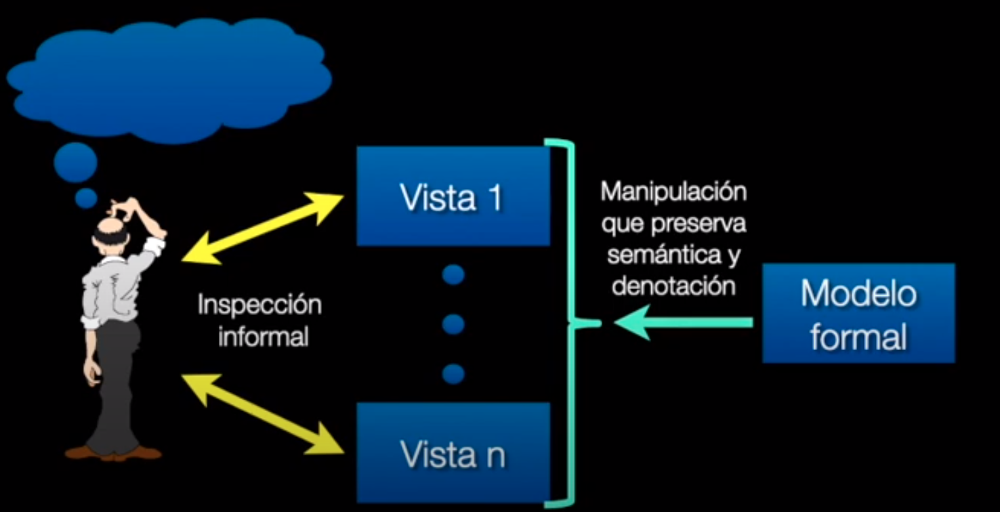

Si tenemos un lenguaje formal que nos permite hacer distintas modificaciones
preservando la semántica y denotación, podemos presentar distintas vistas del
modelo formal para que una persona las inspeccione y se de cuenta de que algo
esté mal

Concretamente, en FSP se puede manipular para mostrarlos de distintas maneras:

- FSP con pretty printing (colores, ordenamiento de la sintaxis, etc.)
- LTS
- LTS minimizado
- Animación

### Verificación


La idea es **garantizar** matemáticamente que dos modelos formales están
vinculados (con alguna noción matematica formal).

Puede ser manual, semi manual o automático.

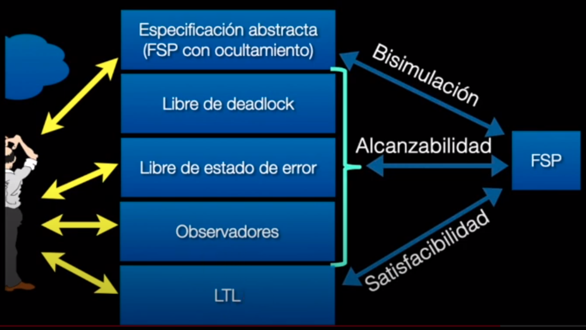

## Deadlock analysis

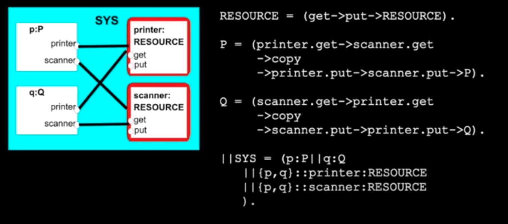

Lleva un deadlock cuando P consigue la impresora y Q al escaner, pero después no
pueden conseguir el segundo.

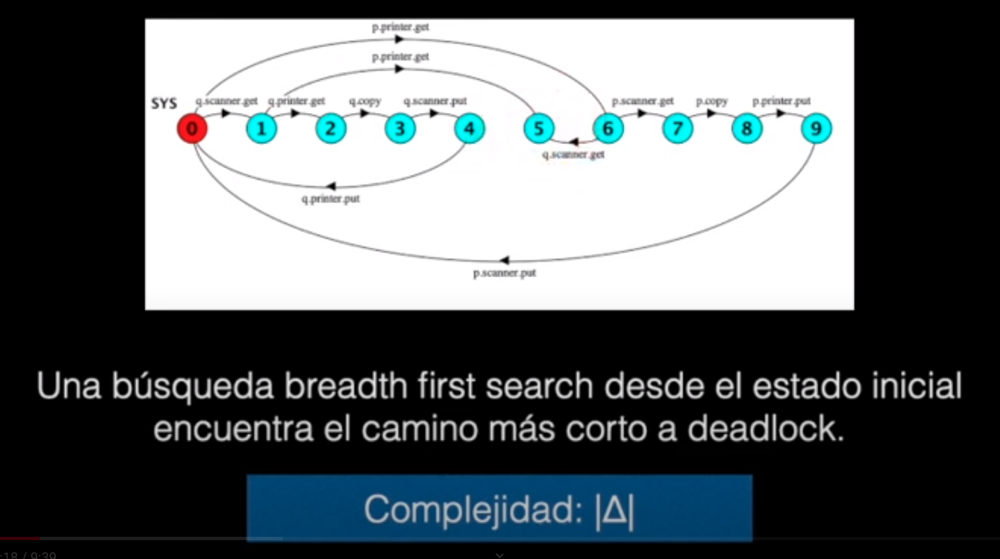

En el LTS asociado, podemos ver en el estado 5 que es uno de deadlock porque no
tiene transiciones salientes. Podemos preguntar para un LTS si tiene un estado
de deadlock, y en ese caso una traza que lleve a él.

### Algoritmo naive

El algoritmo para encontrar deadlocks (naive) involucra construir el LTS y hacer
BFS desde el estado inicial para ver si encontramos un estado de deadlock.

Es lineal con respecto al tamaño de la composición

> Conviene hacer BFS porque si encontramos un estado de deadlock, tenemos la
> traza más corta que llega a él (feedback más amable)

### Explosión de estados

Lineal con respecto al tamaño de la composición es peor de lo que suena


Tiene 2^20 estados potenciales

Este fenómeno se llama **explosión de estados**. El número de estados de la comp
paralela crece exponencialmente.

Una idea clave para hacerlo más escalable es **partial order reductions**. La
idea es que si tengo un estado que tiene dos eventos a y b, a pertenece al
alfabeto de uno y b del otro pero no son vars compartidas, luego de que suceda
a, b todavía va a estar habilitado porque el componente que puede hacerlo no
cambia de estado. Idem a. entonces llegamos al mismo estado "por arriba o por
abajo". *el interleaving de a y b no importa* cual sucede antes o después proque
son procesos independientes. Hay toda una parte de la comp paralela que no tengo
que explorar, porque es *simétrica* con la otra parte de la composición.


### Soluciones de deadlocks

- **Cambiar orden acciones**
  
  En el primer ejemplo del printer y el scanner, alcanza con que intenten de
  obtenerlos en el mismo orden (cambiando el orden del proceso P por ej).

- **Timeouts**
  
  Otra forma es mediante **timeouts**, una alternativa al `get` que vaya a
  `timeout` (como estado interno)

  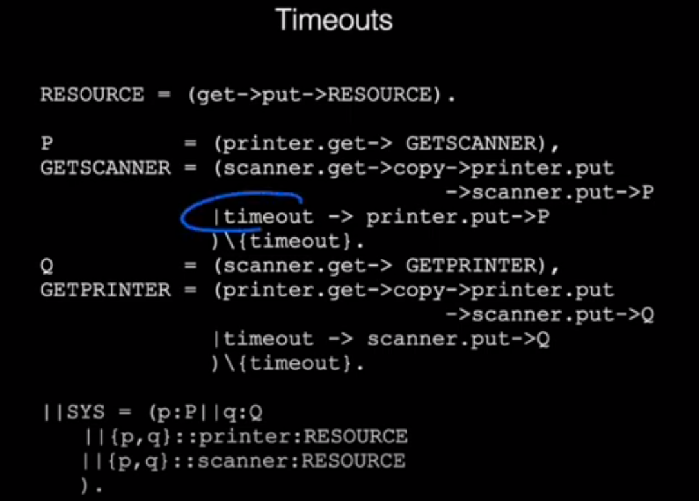

  pero tiene un problema, ambos podrían no obtener nunca el 2do recurso porque
  hacen siempre timeout.

- **Preemption via watchdog**

  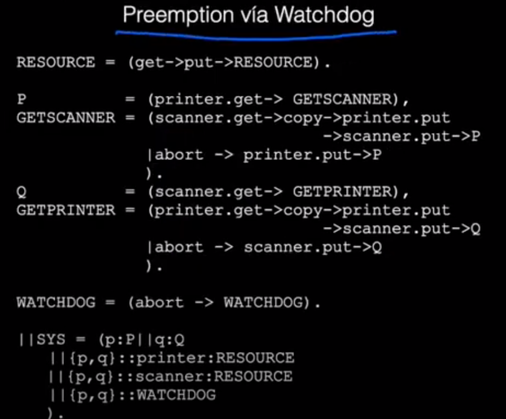

  watchdog es un proceso que observa el avance del sistema, y cuando detecta que
  no hay, aborta uno de los procesos. Puede haber ejecuciones donde nadie
  consigue el proceso, por un livelock (siempre son abortados).

  Es parecido al timeout pero con un monitor externo centralizado, en vez de que
  cada uno tenga su timer interno.

- **Parametrización para romper simetría**

  En vez de tener todos los filosofos tomando de la izq y después la der, podes
  tener unos que toman de la izq y otros de la der, resultando que no tenga
  deadlock
  
  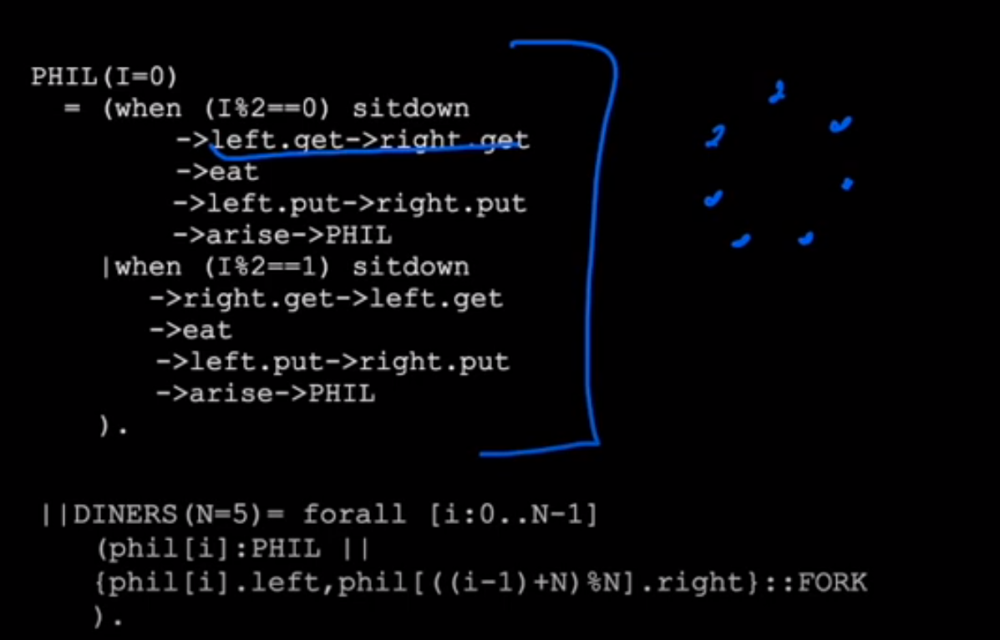

## Exclusión mutua

### Ejemplo de problema con exclusión mutua

El incremento de la variable compartida no es atómico, es una oportunidad para
un problema.

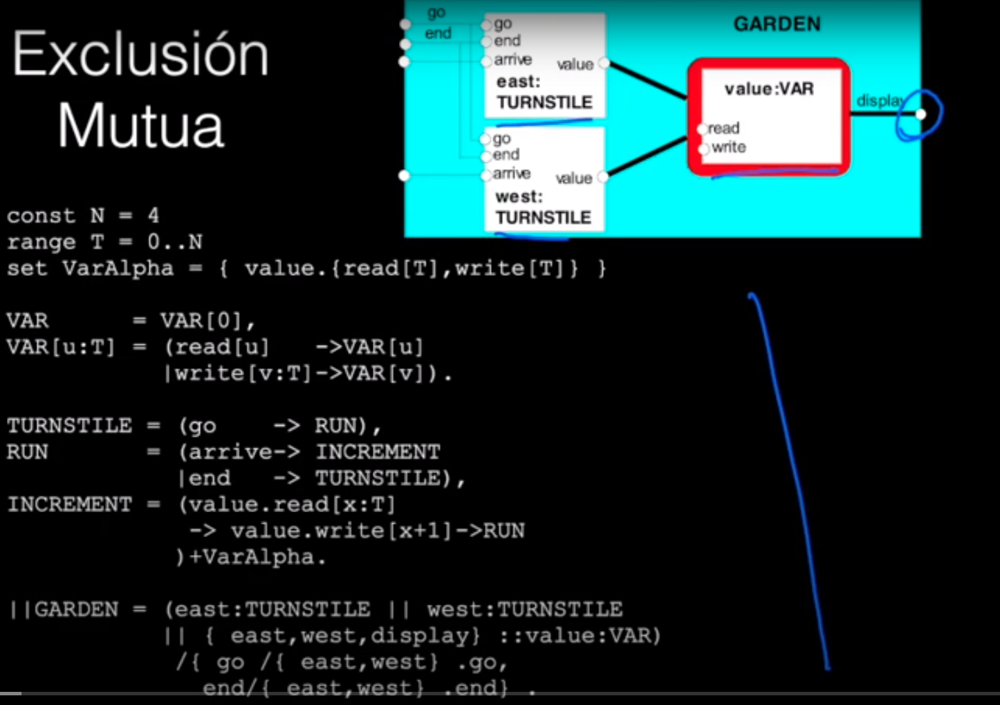


Llegaron 3 pero leemos 2, por la interferencia en el acceso concurrente a una
var compartida.

### Estados de error

Esto lo pudimos hacer manualmente, pero no se puede hacer mediante alguna
técnica de verificación?

Para lograrlo, le damos una pequeña vuelta a LTS para permitiendo la
especificación de estados distinguidos de error (en los papers es un estado PI).

- No hay transiciones salientes de uno (como deadlock)

- y en la composición paralela, a dif de deadlock, un estado es de error si
  cualquiera de los componentes está en estado de error

  El sistema compuesto entra en error si cualquiera de sus componentes lo hace.
  Esto no es así para deadlock.

  > hay una pregunta en la lección de deadlock que es si P tiene un estado de
  > deadlock, para todo Q, P || Q también lo tiene, pero es falso. Pero si
  > vale para estados de error.

- En MTSA se representan con el -1

Ejemplo

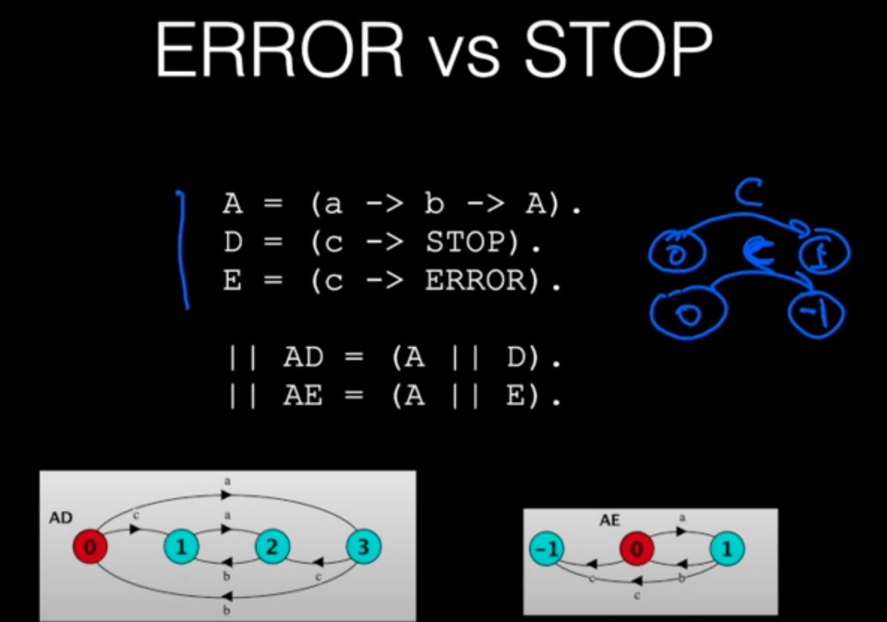

- AD no tiene deadlock porque A siempre puede hacer acciones
- En AE si E hace c queda en error

### Tests

Ejemplo de un test

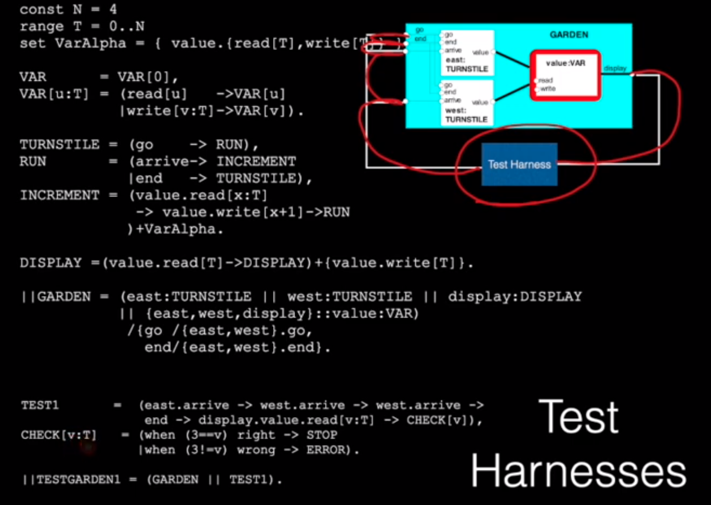

Con esto, podemos hacer un chequeo de **safety**: DFS desde el inicial buscando
si es alcanzable el estado -1 (de error)

Podemos hacer un test que restringe el comportamiento del sistema, y hace más
chico el problema de verificación (3 arribos en un orden en particular).

Pero no da garantías totales porque el test restringe el comportamiento del
sistema.

### Observadores de propiedades

Pero no queremos restringir el comportamiento del sistema. Entonces hacemos que
un proceso *observe* y estimule el sistema, pero que no restrinja como se
comporta.

La composición de los procesos debería cambiar el comportamiento si **se viola
alguna propiedad**. Con el observador vamos a *codificar* una propiedad.

- Si el sistema satisface la propiedad, (S || Obs) ~ S (es equivalente).
- Si no, (S || Obs) tiene un estado de error cuya traza queremos ver para
  entender la naturaleza del problema.

Esto nos da garantías totales

Ejemplo:

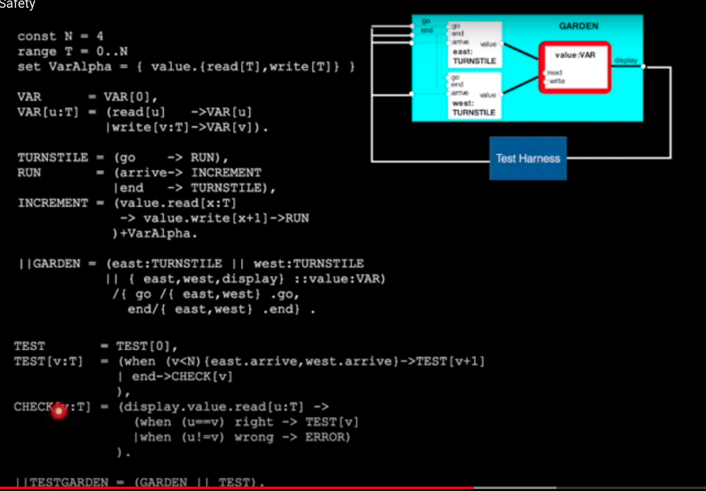

No restringe la cantidad de arrivos en el test. Este no llega a ser un
observador ya que debería ser v <= N.

FSP viene con una palabra clave `property` que ayuda a especificar observadores.
Uno usa eso con un proceso que tiene todo el comportamiento aceptable. Y lo que
hace, es agregar transiciones a error para todas las transiciones que no están
habilitadas en algún estado


> En 0 agrega trans a error por respond porque no está habilitado, y en 1 por
> command.

Property garantiza que en todos los estados, todas las acciones del alfabeto de
la propiedad están habilitadas. Es imposible que el proceso compuesto bloquee el
comportamiento del sistema.


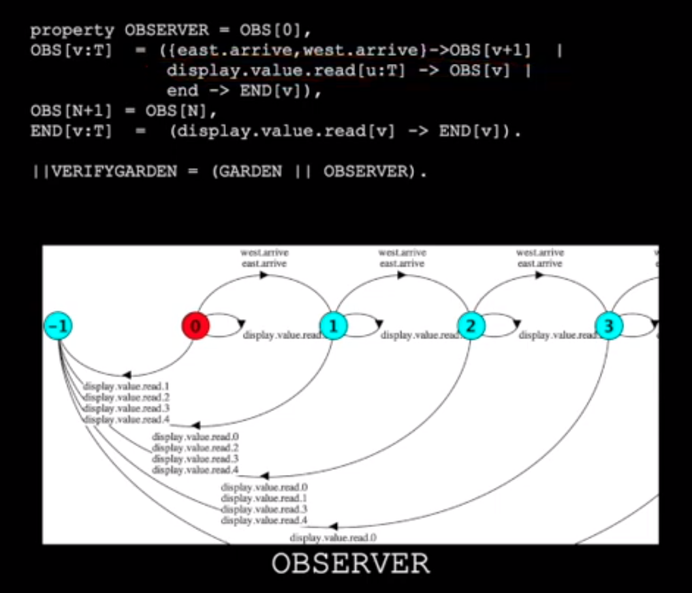

Un fix para garden es agregando un lock

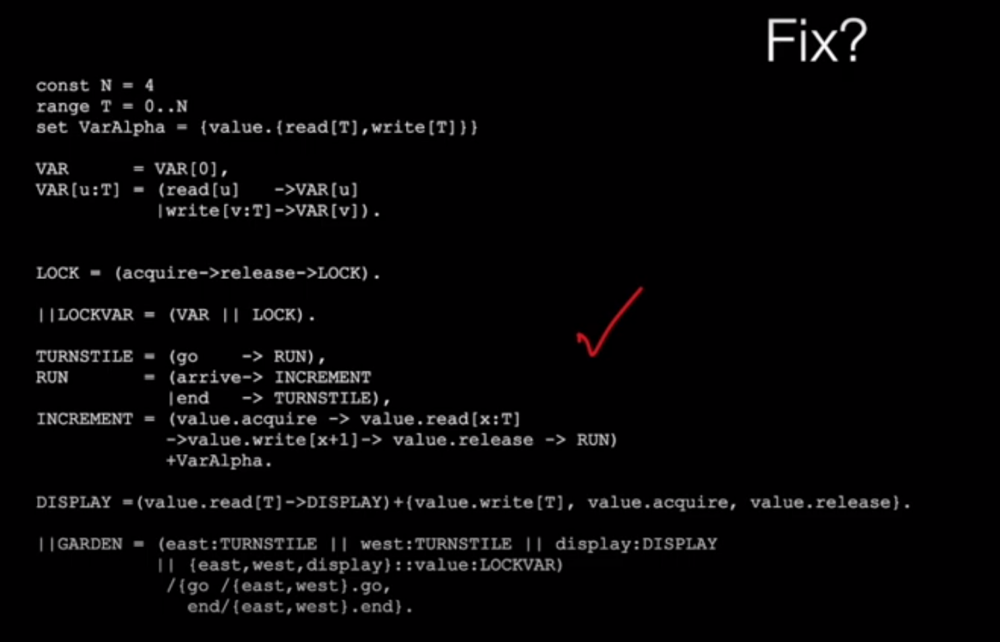

En el video falta hacer una observación: la palabra clave "property" se debe
utilizar con un proceso que define comportamiento determinístico.
Supongamos un proceso

```
SYS = (a -> b -> SYS | a -> c -> SYS).
```

 y supongamos que MTSA admitiera 

```
property P = (a -> b -> P | a -> c -> P).
```

Si hiciéramos un chequeo de safety del procesos (P || SYS) el output de MTSA sería

```
Trace to property violation in Prop:
a
c
```

pero a c es una válida

## Tipos de propiedades

En sistemas concurrentes en general, divide en dos tipos: safety y liveness
(asumiendo que es libre de deadlock)

- Deadlock
- Una propiedad es de **safety** cuando el sistema es *seguro*
  - *Nunca nada malo sucede*
  - Todos los contraejemplos son trazas finitas
    - El momento en donde la cosa mala sucede es un ejemplo de que algo malo
      sucede

  > todas las props que hablamos hasta ahora son de safety, donde nosotros
  > codificabamos lo malo con estados de error

- Una prop es de **liveness** cuando

  No alcanza con que no lleguemos a un estado de error, quiero que cierto
  evento bueno que estoy tratando de lograr siempre sucede
  Si tenemos un livelock, no se viola una prop de safety pero tampoco sucede
  algo bueno en el sentido de que no progresa hacia alguna noción de objetivo
  cumplido.
  
  - *Algo bueno siempre sucede*
  - Todos sus contraejemplos (salvo deadlocks) son trazas infinitas.

### Composicionalidad de safety

Las propiedades de safety además son *composicionales*: si S satisface una prop
de safety P. entonces para todo T, S||T también satisface P

> T restringe, si S no hacia algo malo, menos lo va a poder hacer restringido.

Si P es un autómata observador y ERROR no es alcanzable en S || P, entonces
ERROR tampoco lo es en (S || Q) || P con cualquier Q.

Puedo construir modelos de componentes e ir componiendolos, y saber para modelos
de mas alto nivel que la prop se sigue cumpliendo. Puedo verificar
*composicionalmente* la correctitud de mi sistema.

## Liveness - Progreso

Es una prop de liveness. Para especificarla,

```lts
progress P = {a1, a2, ..., an}
```

donde a1, a2, ... an son las acciones que denotan un progreso útil del proceso.

es verdadera si para cada ejecución infinita, por lo menos una acción aparece
infinitas veces bajo la suposición de **fair choice**.

Es la negación de "starvation" (se le deniegan los recursos que necesita
infinitamente). Depende de dominio, porque "hacer su trabajo" puede cambiar.

En MTSA requiere para poder chequearlo que el modelo no tenga deadlocks

### Fair choice

Es una condición de *fairness* sobre como un scheduler elige las transiciones
que se van ejecutando en un LTS.

La composición paralela captura todos los schedulings posibles. Pero no siempre
eso es adecuado para nuestro dominio, uno a veces quiere imponer fairness sobre
eso. Y fair choice es una.

Una ejecución en un LTS es válida bajo **fair choice** si un estado cuando es
visitado infinitas veces, todas sus transiciones salientes también lo son.

Por ej

(toss, heads)$^\omega$ = (toss, heads, toss, heads, ...)

($^\omega$ es como la clausura de kleene pero para cadenas infinitas)

no es válida porque pasa infinitas veces por el 0 y el 1, pero no pasa infinitas
veces por 0 y 2. Tampoco sería fair choice el análogo

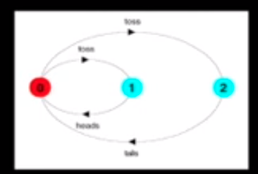

Para modelar el progreso,


No sería correcto modelarlo de la siguiente manera,

```lts
progress HEADSorTAILS = {heades, tails}
```

porque es que *alguna* de las dos aparezca infinitamente, entonces la siguiente
moneda trucha (que te deja elegir si sale siempre cara o seca) no la violaría

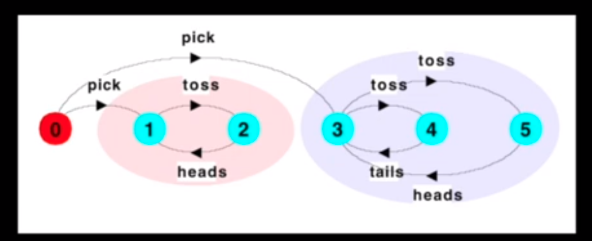

### Análisis de progreso

La idea es encontrar las componentes fuertemente conexas "terminales" o bottom
de las que no se puede salir:

- Todo estado es alcanzable desde cualquier otro
- No existen transiciones de un estado del conjunto a un estado fuera de él

Bajo fair choice, una vez alcanzado un BSCC (Bottom Strongly Connected
Component) todas las transiciones son inevitables.

### Ejemplo - Controlador de un puente de un solo carril

Un puente de un solo carril de dos sentidos. Ejemplo de el ejemplo clásico de
exclusión mútua a un recurso con dos threads (rojos y azules)


Un modelado de una prop de progreso podría ser

```lts
progress BLUECROSS = {blue[ID].enter}
progress REDCROSS = {red[ID].enter}
```

y es razonable asumir fair choice?

> Duda: no me queda claro por qué fair choice no lo modela

### Prioridad de acciones (Action priority)

Operadores de prioridad

- ||C = (P || Q) << {a1, ..., an}
  - a1, ..., an tiene mas prioridad que el resto de las acciones del proceso.
  - Si tengo un estado que tiene transiciones a1 y b1, b1 no va a estar (las
    elimina con ese criterio)
- ||C = (P || Q) >> {a1, ..., an}
  - Es el operador dual (menor prioridad), si tengo a1, b1, elimina la de a1

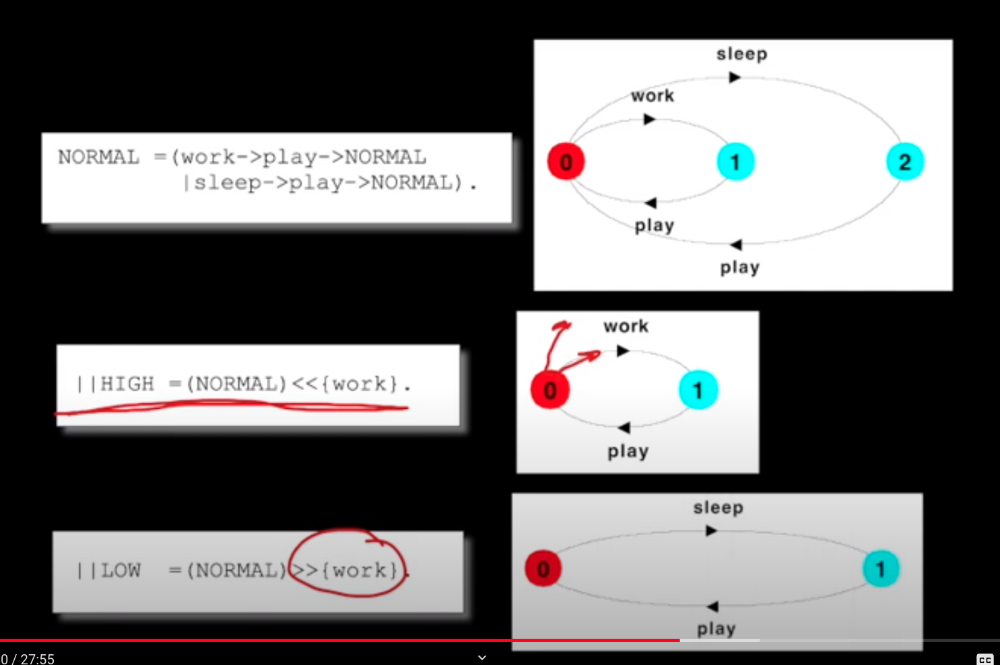

Para modelar el problema de que no siempre se va a elegir que entre uno de otro
color sobre que sigan entrando del color que ya tomo el puente, podemos modelar
un *puente congestionado*,

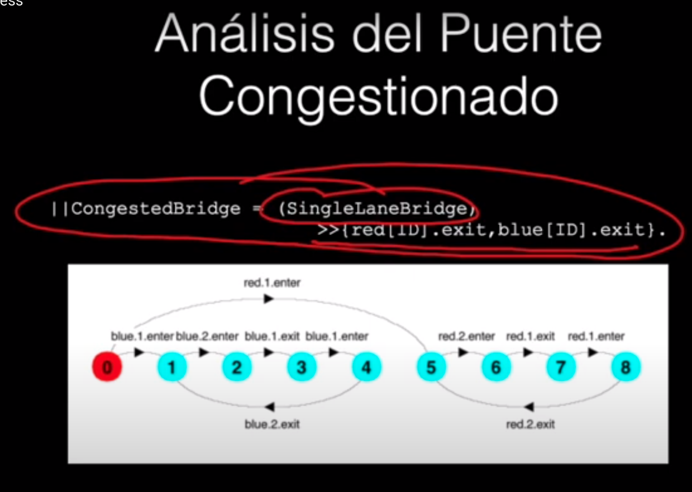

hay dos conjuntos terminales.

### Solución puente (Puente 2.0)

Una solución al problema del puente es que sea conciente de que hay autos
esperando del otro color

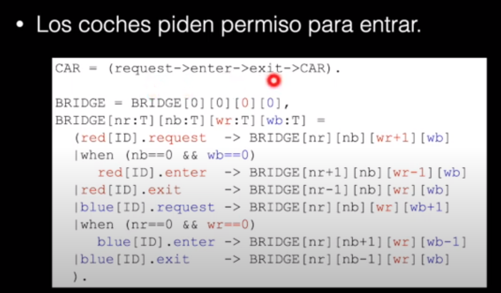

Esto introduce un deadlock si todos los autos piden pero ninguno logra entrar

```
Trace to DEADLOCK:

  red.1.request
  red.2.request
  red.3.request
  blue.1.request
  blue.2.request
  blue.3.request
```

Una solución para esto es usar el **algoritmo de Peterson**

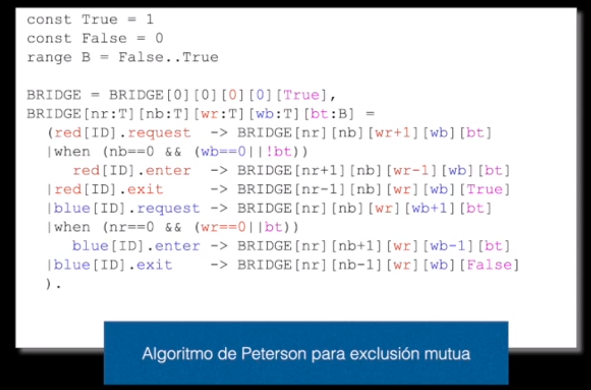

rompe asimetrías y le da prioridad a uno o al otro. Se rompen los empates.

### Composicionalidad de liveness

Si tengo S que satisface una prop de liveness L. S || T también lo satisface?
Para cualquier T.

La respuesta es que **no**. Es facil ver para la moneda que si compones con
`STOP + {heads}` bloquea que salga cara e introduce un deadlock.

## Bib

Jeff Magee and Jeff Kramer. 2000. Concurrency: State Models & Java Programs.
John Wiley & Sons, Inc., New York, NY, USA.

