# Lección 15 - Model checking de LTL

- [Lección 15 - Model checking de LTL](#lección-15---model-checking-de-ltl)
  - [Repaso](#repaso)
  - [Algoritmo](#algoritmo)
  - [Autómatas de Buchi](#autómatas-de-buchi)
  - [Autómatas de Buchi generalizados](#autómatas-de-buchi-generalizados)
  - [Traducción LTL a Buchi](#traducción-ltl-a-buchi)
    - [Tableau para Logica Prop](#tableau-para-logica-prop)
    - [LTL Tableau](#ltl-tableau)
    - [Algoritmo LTL2Buchi](#algoritmo-ltl2buchi)
    - [Intuición](#intuición)
    - [Ejemplo expansión](#ejemplo-expansión)
    - [Paso 2](#paso-2)
    - [Paso 3](#paso-3)
    - [Paso 4 - Traducir buchi generalizado en buchi común](#paso-4---traducir-buchi-generalizado-en-buchi-común)
  - [Algoritmo más en detalle](#algoritmo-más-en-detalle)
    - [LTS a Buchi](#lts-a-buchi)
    - [Producto de buchis](#producto-de-buchis)
    - [Chequeo de vacuidad de un lenguaje](#chequeo-de-vacuidad-de-un-lenguaje)
  - [Ejemplo de model checking LTL](#ejemplo-de-model-checking-ltl)
  - [Bibliografía](#bibliografía)

## Repaso

LTS

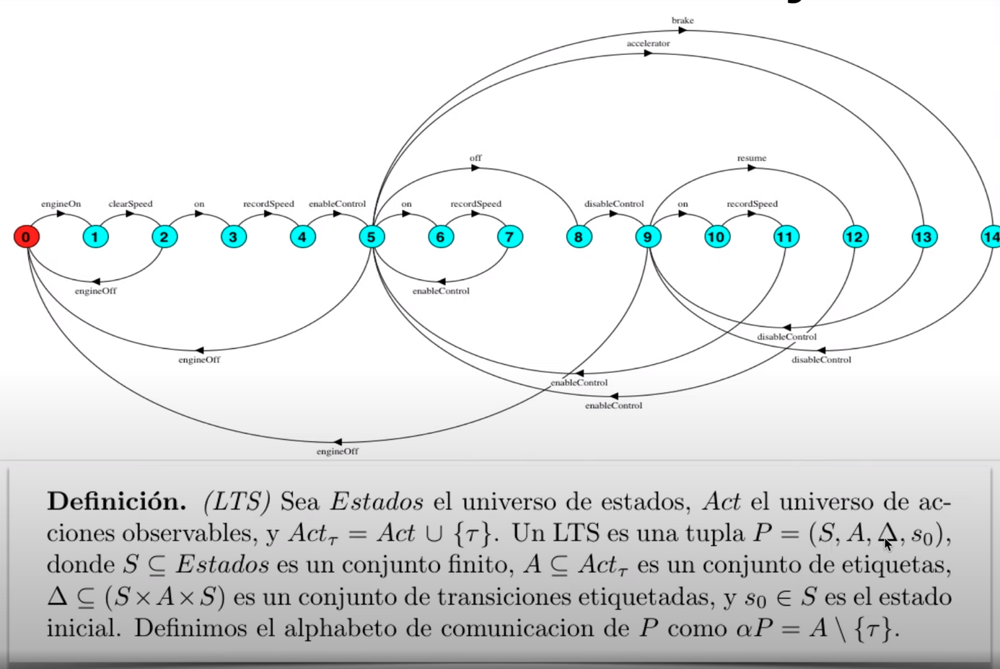

Vimos LTL. Sintaxis:

- p, q, r props atómicas
- Operadores de la lógica proposicional: not, and, or, etc.
- Operadores modales
  - [] a always
  - <> a eventually
  - X a next
  - a U b until
  - a R b release

La semántica de LTL se explica a partir de una traza (sucesion de estados) donde
los estados son valuaciones de las variables proposicionales.


Semántica del operador Release (está mal en el video)

```
a R b = (b U (a ^ b)) v []b
```

## Algoritmo

Queremos verificar props sobre progs concurrentes. Los programas los vamos a
describir con un LTS M, y las props con una formula LTL P. Vamos a definir un
**algoritmo** que lo chequee automáticamente, retorna true si todas las trazas
de M satisfacen P. Outline del algoritmo:

Entrada: LTL $P$, LTS m

1. Convertir la fórmula LTL $\neg P$ a un autómata $A_{\neg P}$ que caracteriza
  todas las trazas que satisfacen no P.
2. Chequear si las trazas de M son disjuntas con las de $A_{\neg P}$
3. Si la intersección es vacía return true, caso contrario devolver alguna traza
   como contra ejemplo.

## Autómatas de Buchi

Una fórmula LTL caracteriza un conjunto de trazas *infinitas*, las que la
satisfacen. Para el paso 1 del algoritmo, queremos construir un autómata $A_P$
cuyo lenguaje sea el mismo que una fórmula LTL P. Pero qué autómata? Tiene que
tener trazas *infinitas*.

Los autómatas de tleng aceptan cadenas finitas y necesitamos infinitas.

Vamos a usar **Autómatas de büchi** (pronunciado buji). Tienen una cantidad
finita de estados pero reconocen los lenguajes $\omega-regulares$. (como los
regulares pero con cadenas infinitas).

Acepta una cadena cuando su ejecución en el autómata visita un estado de
aceptación infinitas veces.

Las fórmulas LTL pueden ser traducidas a Buchi, el autómata acepta una traza si
y solo si la traza satisface la fórmula.


> hasta acá todo igual

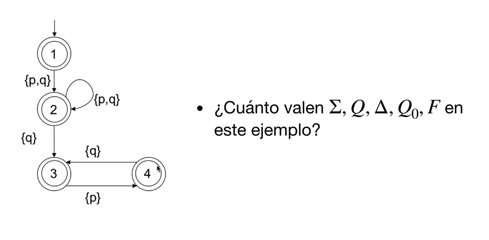

El lenguaje aceptado es un conjunto de secuencias infinitas sobre $\Sigma$. Si
$L(A)$ es el lenguaje aceptado y $\Sigma^\omega$ el de las cadenas infinitas
sobre $\Sigma$, entonces $L(A) \subseteq \Sigma^\omega$.

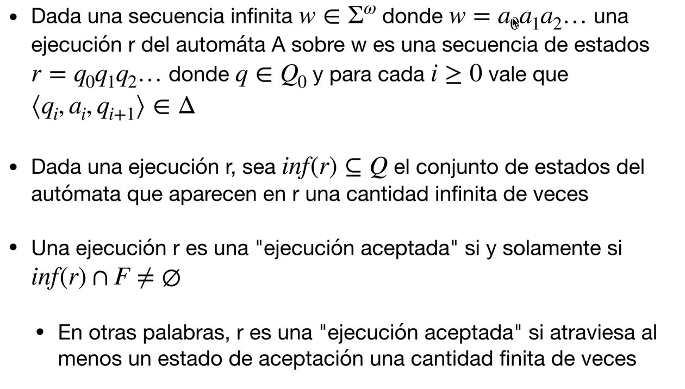


## Autómatas de Buchi generalizados

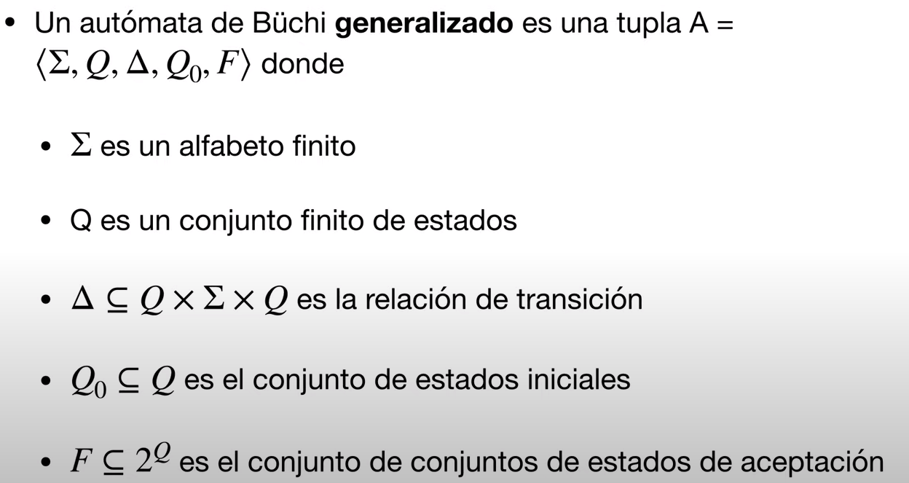

La diferencia está en el conjunto de conjuntos de estados de aceptación

Lenguaje aceptado:

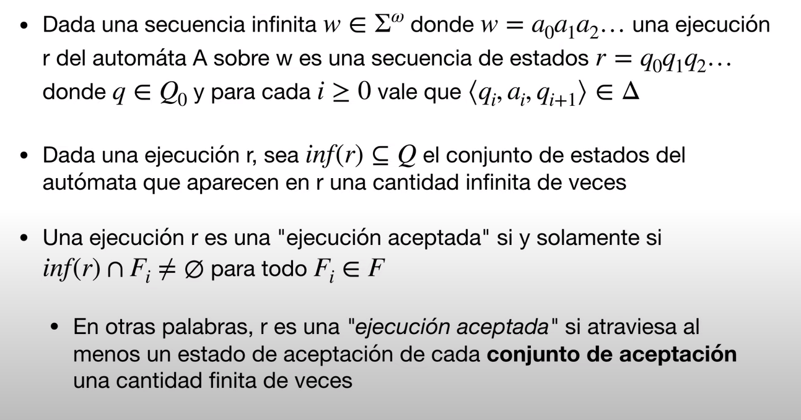

tiene que visitar al menos un estado de cada conjunto de aceptación una infinita
cantidad de veces. Tengo más requisitos.

Se puede transformar de buchi a gbuchi (trivial) y de gbuchi a buchi (lo vemos
después)

## Traducción LTL a Buchi

Ejemplos


### Tableau para Logica Prop

Es un procedimiento para ver si una formula prop es satisfacible. La idea es
descomponer top-down la fórmula en sub-fórmulas, así armando un árbol. Una
fórmula va a ser satisfacible si al menos una rama del árbol "no se cierra" (i.e
que no tiene loops).

Reglas de descomposición

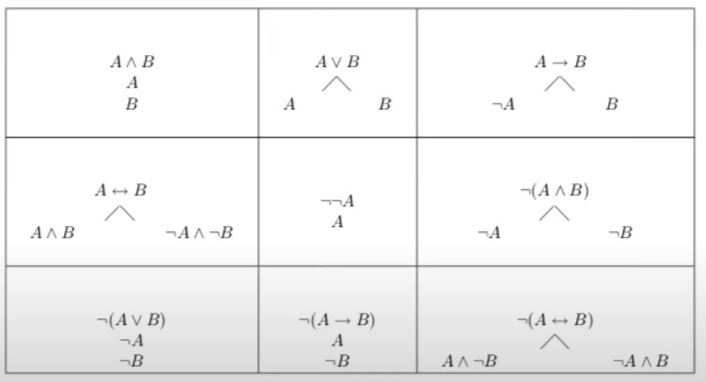

Ejemplo:

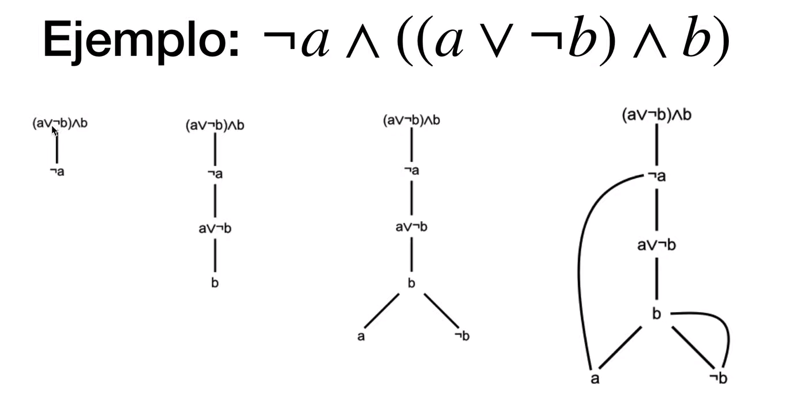

Como ambas ramas llevan a un loop (i.e se cierran), la fórmula no es SAT.

> A quién se le ocurre decir "se cierra" en vez de que algo tiene un ciclo?

### LTL Tableau

Vamos a construir un autómata de Buchi a partir de un LTL usando una idea
parecida a la descomposición de Tableau.

La idea va a ser que cada estado del autómata de buchi sepa qué formula debe
reconocer, y que al avanzar de $s$ a $s'$ por $a$, la fórmula $s'$ sea como la
de $s$ después de haber "procesado" $a$.

### Algoritmo LTL2Buchi

> Algoritmo de Gerth, Peled, Vardi, Wolper del 95

Input: Una fórmula LTL en forma normal positiva (solo proposiciones pueden estar
negadas)

Output: Un Buchi que reconoce el mismo lenguaje

Reglas para llegar a FNP:


Nos alcanza con un algoritmo que trate R, U, X, and y not.

Cada estado tiene tres conjuntos de propiedades:

- **New**: las propiedades que deben valer desde el estado pero que no fueron
  procesadas por el algoritmo.
- **Old**: las propiedades que deben valer desde el estado y que ya fueron
  expandidas por el algoritmo.
- **Next**: las propiedades que deben valer en los estados sucesores inmediatos.

y una lista de estados **incoming**, los predecesores inmediatos

### Intuición

Input: Fórmula LTL P

1. Crear un nodo `n = <New={P}, Old={}, Next={}, Incoming={}>`
2. Para cada nodo n con formula f en New, procesar f creando nuevos nodos.
   Continuar hasta que no exista f en New en ningun nodo n.
3. Construir autómata de buchi generalizado a partir del autómata
4. Traducir el buchi generalizado a un buchi común

> duda hasta acá: por qué vamos de gbuchi a buchi?

### Ejemplo expansión

Ejemplo de formula a U b

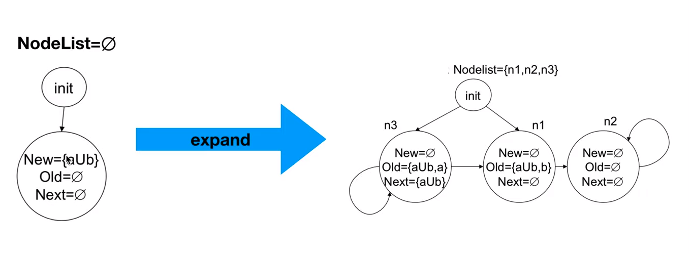

### Paso 2

```text

TranslateLTL2Buchi(f) {
  // tiene un conjunto de nodos ya proceados como último argumento
  // arrancamos el algoritmo de traducción invocando a la rutina aux expand con un nodo inicial cuyo new es la fórmula F y una lista vacía de nodos procesados.
  expand(<Incoming = {init}, Old = {}, New = {f}, Next = {}>, {}) 
}
```

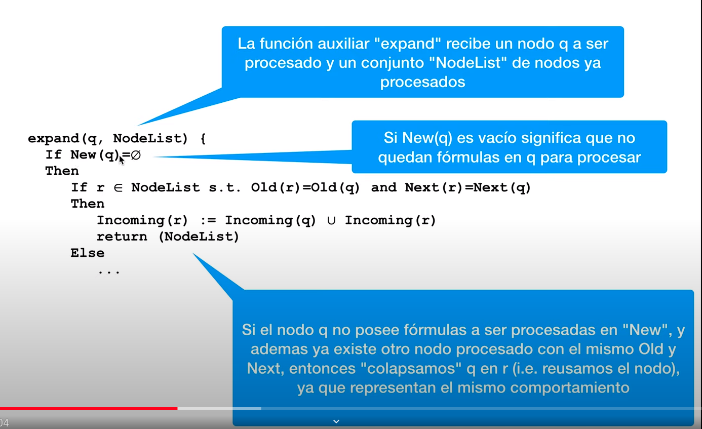
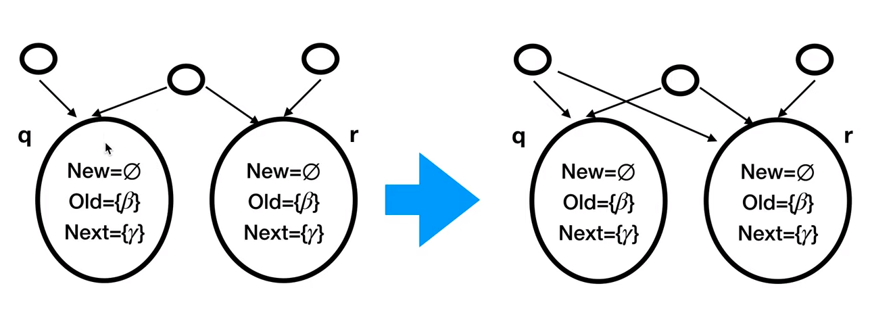

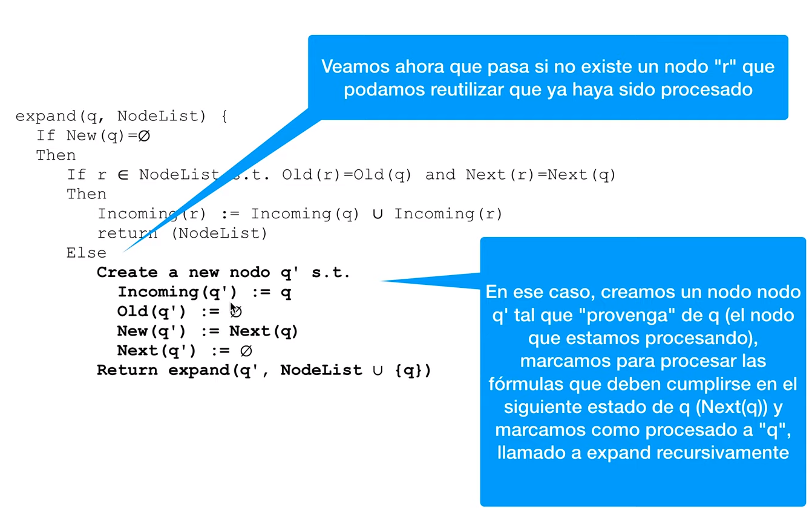


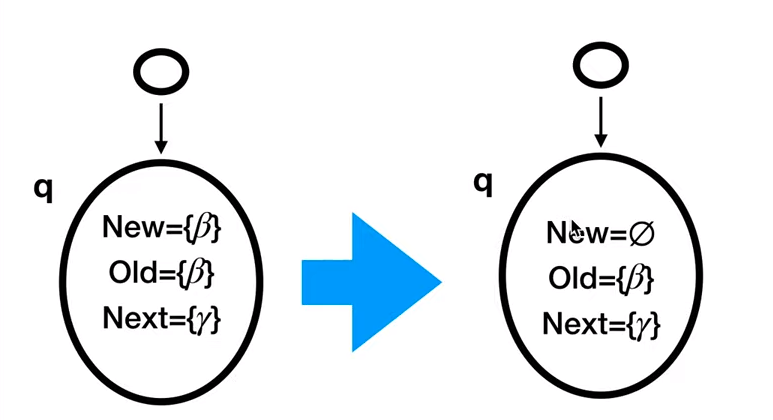

Si la fórmula no fue procesada, hay que separar en casos según f

- Si f es primitiva/literal

  
  

- Disyunción

  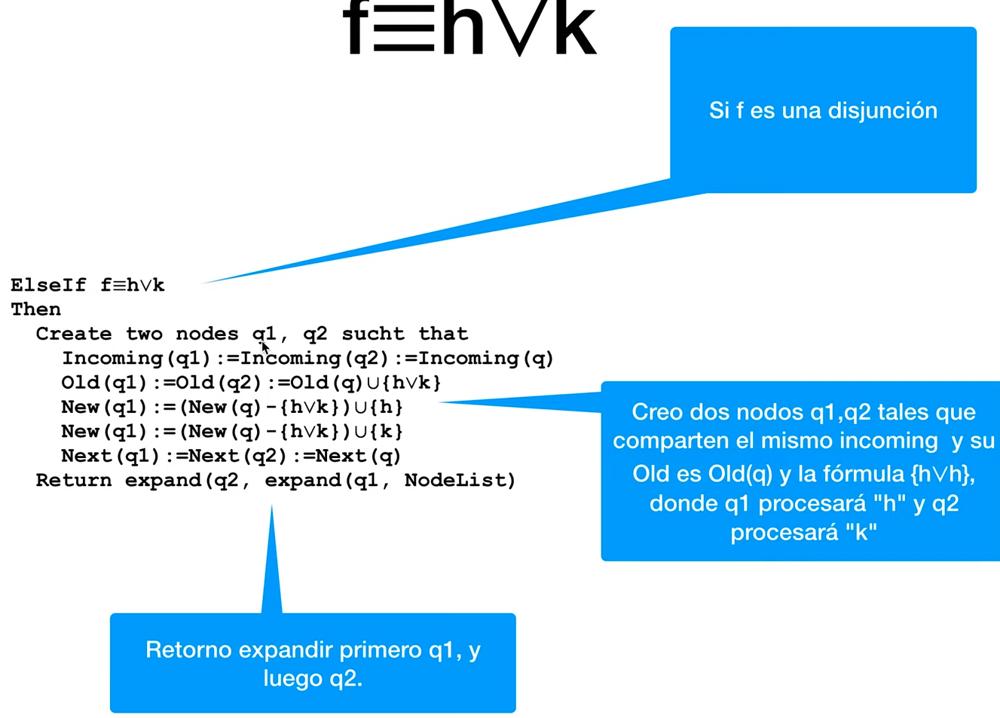
  

  Separa en dos nodos y a cada uno le da la responsabilidad (ag en new) de
  procesar cada parte.

- Conjunción

  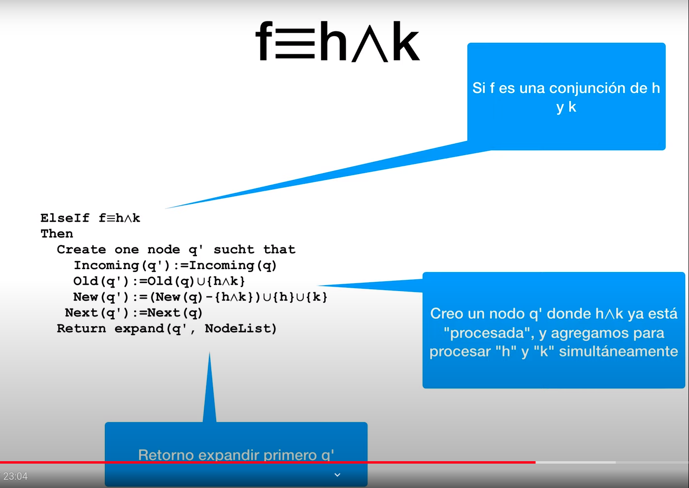

  No crea dos nodos, crea uno único que tiene ambas fórmulas en new. Reemplaza
  el actual

  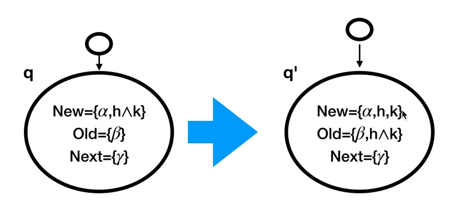

- Next

  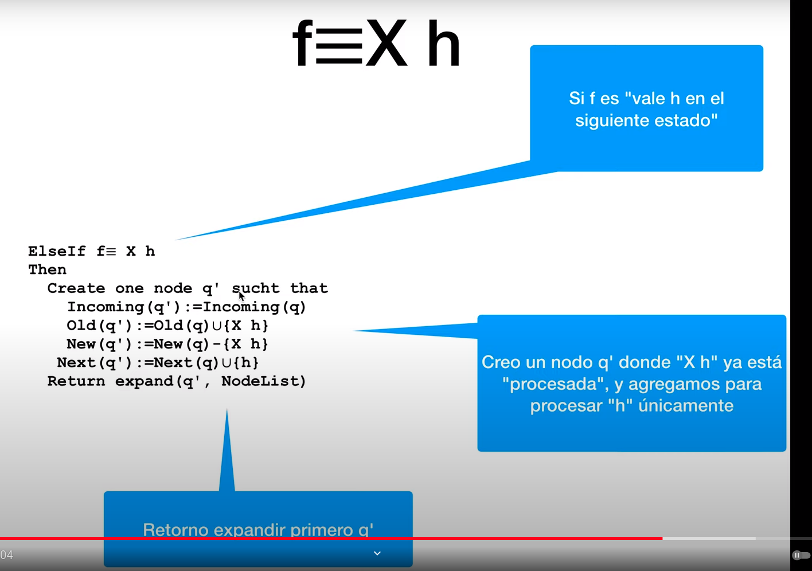
  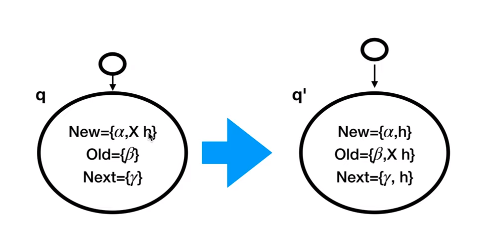

  Se agrega al next del nodo. Hay un typo, en New no tiene que valer h

- Until

  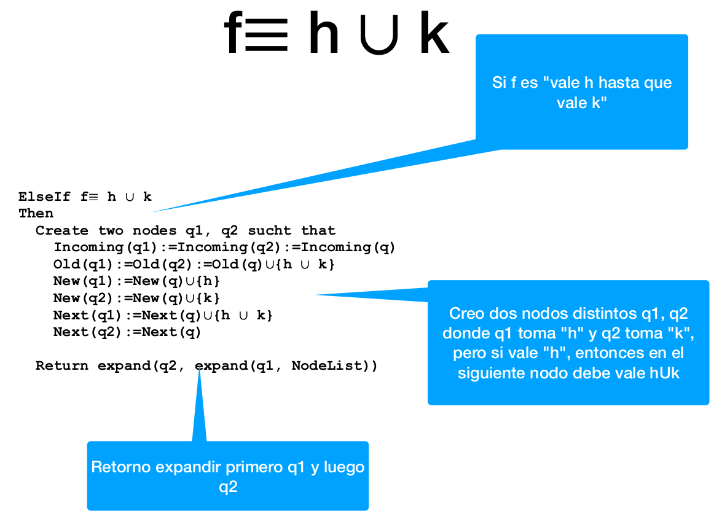
  

  Creo q1 y q2, al primero le doy la responsabilidad de procesar a y le digo que
  en el prox tiene que valer a U b y al segundo la responsabilidad de procesar
  b.

- Release

  
  

> box y diamond se escriben como release y until

En las slides hay un ejemplo de un seguimiento para el input `a U b`, llevando a
este autómata

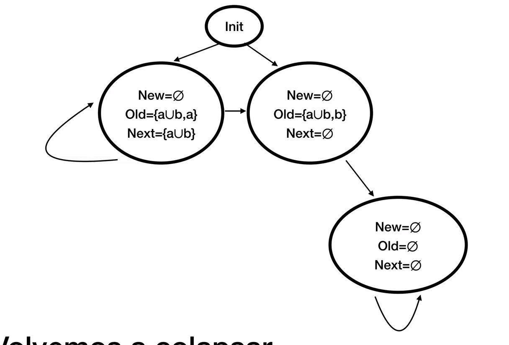

### Paso 3

Tenemos un autómata, pero no es de Buchi generalizado. Tenemos que construirlo.

El resultante va a ser $A = \langle \Sigma, Q, \Delta, Q_o, F \rangle$ donde

- $\Sigma$ son subconjuntos de proposiciones de la fórmula LTL
- $Q = NodeList \cup \{ init \}$
- $Q_0 = \{ init \}$
- $\Delta$ son $(q, d, q') \in \Delta$ sii $q \in$ incoming($q'$) y d satisface
  la conjunción de las proposiciones negadas y no negadas que están en Old(q')

  El conj old representa que cosas son verdaderas en cada estado.

  

- $F = \{ F_1, F_2, \dots \}$ se define,
  - para cada sub fórmula h U k existe un estado de aceptación $F_i$ que
    contiene todos los estados q tales que o bien k in Old(q) o bien hUk not in
    Old(q)
  - Si no hay sub fórmulas until, entonces F = {Q} (son todos estados de
    aceptación de un único conjunto, i.e tienen que valer todos infinitamente
    para aceptar)

  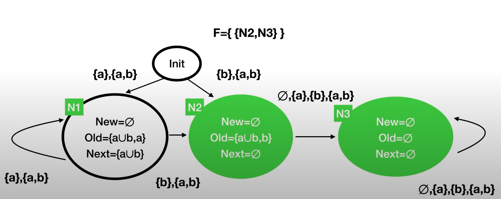

El autómata de buchi generalizado creado entonces es este. Podemos cambiar los
conjuntos de valuaciones en las transiciones por una fórmula que los caracterice
(cuando vale todo, es true)

Autómata de buchi generalizado que acepta las trazas que satisfacen la fórmula
LTL aUb


El algoritmo es exponencial con respecto al tamaño de la fórmula.

### Paso 4 - Traducir buchi generalizado en buchi común

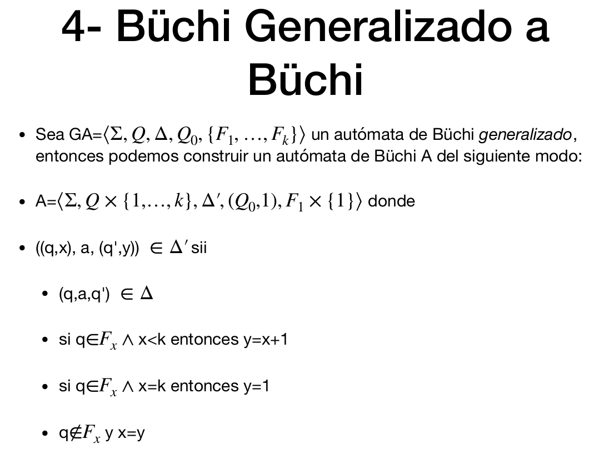

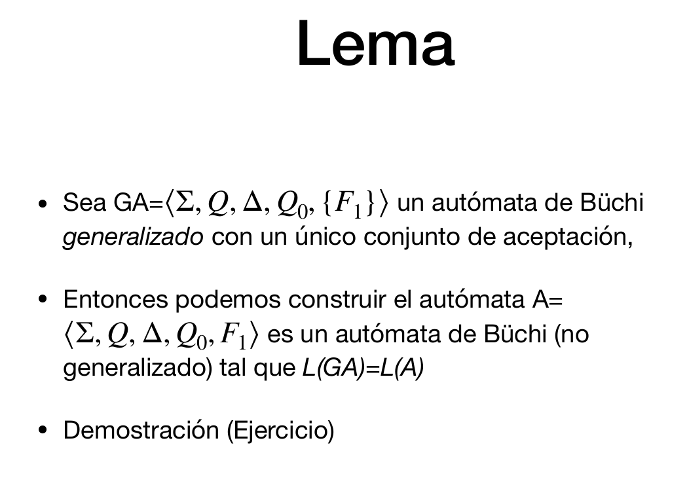

El autómata final entonces es este


es lo mismo pero cambiando F, por el lema anterior

## Algoritmo más en detalle

Con más detalle, el algoritmo que tenemos que hacer es este


Ya vimos el paso 1, ahora tenemos que hacer el 2.

### LTS a Buchi

la traducción lts a buchi es como sigue:


la noción de aceptación del lado del sistema del programa concurrente, son
todas las trazas, no nos queremos perder de ninguna, y por eso el conj de
aceptación de buchi son todos los estados.

### Producto de buchis

El producto (composición paralela) de autómatas de buchi se computa como sigue

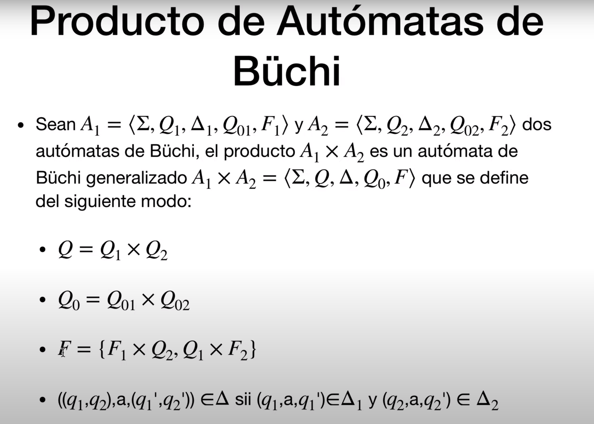

Y tenemos el siguiente lema sobre la comp paralela de ellos,


esto nos va a servir mucho, porque sabemos que un lenguaje van a ser las trazas
que admite mi sistema, y el otro las trazas que admite la negación de la
propiedad que quiero probar. Si veo que la int es no vacía hay un problema:
tengo una ejecución posible de mi sistema que no cumple la propiedad que quiero
que se cumpla.

### Chequeo de vacuidad de un lenguaje

Dado un buchi queremos verificar si el lenguaje que acepta es vacío.

Un buchi acepta una palabra cuando existe una ejecución que visita un estado de
aceptación infinitas veces.

Algoritmo:

1. Buscar un ciclo que contenga un estado de aceptación y sea alcanzable desde
   estado inicial

   Buscar una componente fuertemente conexa, alcanzable, que contenga un estado
   de aceptación

   > por qué alcanza con buscar una cc para ver que haya un ciclo?
   > creo que porque fuertemente conexo implica poder ir y venir en un digrafo,
   > y eso quiere decir que hay un loop
  
2. Si no existe, el lenguaje que acepta el autómata es vacío.

"en algo3 vimos" (de donde sacaste esto JPG) que hay dos algoritmos conocidos
con complejidad O(n + m) para calcular componentes fuertemente conexas. Uno es
Kosaraju (un poco más simple, vemos este) y el otro Tarjan.

## Ejemplo de model checking LTL

Acá hay un ejemplo de model checking

https://www.youtube.com/watch?v=f85-f9RP5mA&ab_channel=SebastianUchitel

y acá otro

https://www.youtube.com/watch?v=u3SuuULTtUA&ab_channel=JuanPabloGaleotti

## Bibliografía

Jeff Magee and Jeff Kramer. 2000. Concurrency: State Models & Java Programs. John Wiley & Sons, Inc., New York, NY, USA. 
